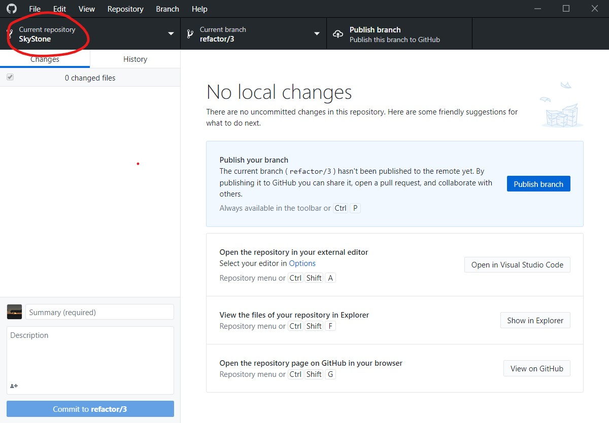
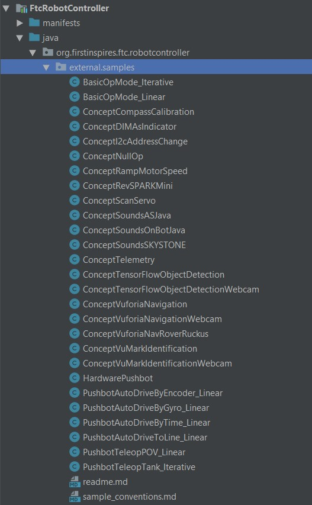

# Intro

I've put together this document to help guide you through the process of creating a new issue, branch and pull request in [GitHub](https://github.com), opening and editing code in [Andriod Studio](https://developer.android.com/studio), and pushing your changes back to Android Studio so we can collaborate on it, as well as to outline some basic expectations I have for the code. All of the screenshots below are from Windows, but the steps should be more less the same on macOS as well except for some repositioned UI elements here and there.

# Before you start working...

Before you start writing a new feature or changing the behaviour of an existing one, please take these steps to outline what you are planning to do:

## `New Issue`

1) [Open the repo in your web browser](http://github.com/jakcharvat/SkyStone),
and switch to the ["Issues" tab](http://github.com/jakcharvat/SkyStone/issues). 

2) Click on "New issue"


3) Fill in an appropriate and descriptive title and description (if needed)

4) On the right side, under "Assignees" click on "assign yourself"


5) You should now see your username under the "Assignees" tab.

6) In the same column of options, click on "Labels",

scroll down and tick the `WIP` label


7) Click anywhere outside of the dialog to close it. You should now see the  `WIP` label under the "Labels" tab. Click on "Submit new issue" to save the issue.


8) Take note of the number assigned to your issue and the URL of the issue's page


## `New branch`

1) Open the GitHub desktop app. Ensure "SkyStone" is selected as the Current repository


2) Ensure that "Master" is selected as the Current branch. If it isn't, click on the "Current branch" selection

and in the dropdown select "master"


3) The master branch should now show up as the Current branch


4) Click on "Fetch origin" to update your local version of the branch from the online one


5) Select "Branch" -> "New Branch" in the app's menu bar


6) Name the branch "[Your Github Username]/[Number assigned to the issue you created]" for example "jakcharvat/6" for my example. This is to ensure that we don't have duplicate branches with the same name, that our branches don't have ridiculously long names, and that we have a place to discuss stuff related to this specific feature


7) Open the project in android studio. To do this, click on "Repository" -> "Show in explorer" in the menu bar of GitHub Desktop ("Repository" -> "Reveal in Finder" for mac), and take note of where the project is located. Then open Android Studio, click on "File" -> "Open..." and navigate to the folder where the project is located. Open the "Team Code" project, which should show the Android Studio icon


8) Wait until Gradle Build finishes


9) Expand `TeamCode -> java -> org.firstinspires.ftc.teamcode` in the "Project" tab on the left, and select `changelog.md`


10) In the editor, find your username, and add the following to the end of the list there: `- [#[Issue Number]]([URL to issue])`, for example for my issue: `- [#6](https://github.com/jakcharvat/SkyStone/issues/6)`. Save the file (CTRL + S / CMD + S)


11) Switch back to the GitHub Desktop App, you should now see the change you made to the `changelog.md` file there. In the smaller text box in the bottom left corner type "Create changelog entry" and then click on "Commit to [your branch]"


12) Once this is finished, click on "Publish branch"


## `New PR (Pull Request)``

1) Return to the [repo in your web browser](https://github.com/jakcharvat/SkyStone) and switch to [the "Pull Requests" tab](https://github.com/jakcharvat/SkyStone/pulls). Select "New pull request"


2) Select `jakcharvat/SkyStone` as the base repository


3) Ensure `master` is selected as the base, and select your new branch as the compare branch. Then click "Create pull request"


4) Change the title to match the title of the issue, and change the desription to "Resolves #[Issue number]", for example "Resolved #6". In the pop-up that appears, select your issue


5) As described in the "New Issue" section, assign the pull request to yourself and add the `WIP` label. Then click "Create pull request"


6) Return to your issue page, and add the `has pull request` label


You are now ready to start working :)

# The Fun Part

You should still have Android Studio open from when you edited the changelog file. We write code in the same folder as the changelog and this readme files are located, by creating new Java classes. If you are writing a helper class that will be used in other programs then all you have to do is use the code pre-generated by Android Studio and continue building off of it.

``` Java
package org.firstinspires.ftc.teamcode;

class ClassName {
  // class content goes here
}
```

If you are writing something that will directly control the robot however, either an autonomous or driver controlled program, there are a few modifications you need to make to this generic code. Firstly, for both, you need to extend `LinearOpMode`:

``` Java
package org.firstinspires.ftc.teamcode

import com.qualcomm.robotcore.eventloop.opmode.LinearOpMode;

class ClassName extends LinearOpMode {
  // class content goes here
}
```

To make the program show on the driver phone you must make one more addition that varies slightly based on whether it is an autonomous or driver controlled class.

**Autonomous:**

``` Java
package org.firstinspires.ftc.teamcode

@Autonomous(name = "Some Name", group = "Some Group")
import com.qualcomm.robotcore.eventloop.opmode.LinearOpMode;

class ClassName extends LinearOpMode {
  // class content goes here
}
```

**Driver Controlled:**

``` Java
package org.firstinspires.ftc.teamcode

import com.qualcomm.robotcore.eventloop.opmode.LinearOpMode;

@TeleOp(name = "Some Name", group = "Some Group")
class ClassName extends LinearOpMode {
  // class content goes here
}
```

Note, in both cases you must provide a name, but the group name is optional and only serves the purpose of better organisation.

# Feature done, now what?

You should now upload the code to GitHub so others can look over it, give feedback, and so that it can eventually be integrated into the final product. To do this, go back to the GitHub Desktop app, where you should see all the changes you've made to all files. In the smaller box at the bottom left provide a brief title summarizing in a few (10 max) words what you did, add a description in the bigger box if you deem necessary. Once done, click the "Commit to [branch]" button, and then the "Push origin" button in the upper right. And done! :)

If you are sure the feature is finished, remove the `WIP` label by clicking on "Labels" and unchecking `WIP`, and add the `test ready` label on both the issue and pull request for the feature. Then, in the pull request, request a review from me by clicking on "Reviewers"


Searching for "jakcharvat" and ticking my name, like you would tick a label.

# Expectations

There are a few things I'd like to see, and a few things I would absolutely **hate** to see. Take a look at the following screenshot:


There's a few things that infuriate me about this. First off, what is `mecaDrive`? Second off, those looooooong chunks of code that does stuff in seemingly sequential order, but that would take a supercomputer to read. And then all the inconsistency. Sometimes there are spaces around an = sign, sometimes not. There are comments that start, but then sort of end without doing any help (`//stop, if` what?). Those curly brackets should be on the same line as the declaration:
``` Java
void hello() { // Good
  // Something
}
```
Not:
``` Java
void hello()
{ // Big big sad
  // Something
}
```

They might seem like small details, but when someone else goes over to read your code it is important it is well documented, properly styled and consistent. This can save the person going through your code hours of pain and headache trying to figure out what `void mysteriousMagicFunction()` does.

As part of the review before I accept your PR to be merged into the master branch I will go over all the changes, and make sure they are readable, decently documented and consistent in formatting. I don't require Google-style code, but I will be rejecting stuff that I find messy. When I reject something I will always give specific issues I find and some ideas on how to fix them. Once you feel you have fixed them, you can request a new review from me. Here's a quick example of what I think code should look like: 


# Tips

Lastly, some tips to help working with Android Studio:

- You can hold CTRL (or CMD on mac) and click a variable name, method or class, which will bring you to it's declaration. This is great to see how a particular feature is implemented
- As you are typing out a function or class name and it is suggested by Android Studio's intelliSense, you can press CTRL+Q on Windows (Unsure of the keymap for mac, sorry) to view some extra documentation of that class or method. This often includes info on what the parameters that method or class takes, what it returns and a brief summary of what it does.
- There are loads of places you can get help from. An AIO place to start is the [FTC Wiki](https://github.com/FIRST-Tech-Challenge/SKYSTONE/wiki), but also useful is the [official FTC JavaDoc documentation](https://first-tech-challenge.github.io/SkyStone/doc/javadoc/index.html). 
- FTC has also very kindly provided us with example code from last year's challenge which you can find under `FtcRobotController -> java -> org.firstinspires.ftc.robotcontroller -> external.samples`


I will be adding more tips if someone points them out or if I remember something else I use on the daily.
